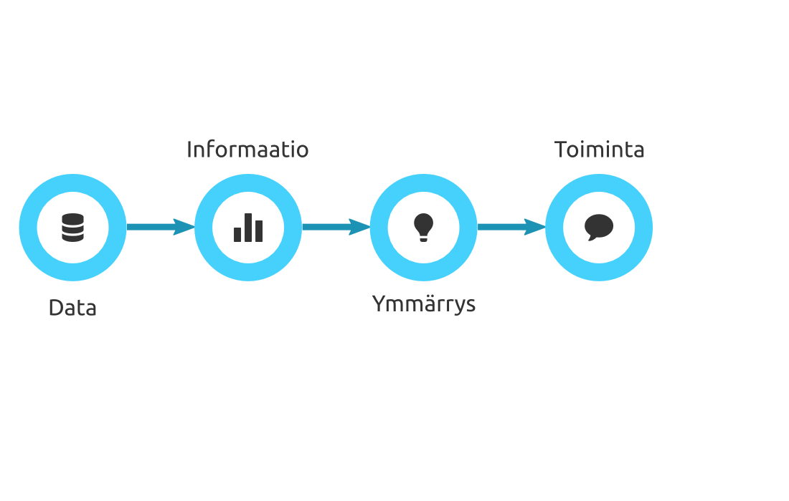

---
title       : R, avoin data ja toistettavat analyysit 
subtitle    : Geoinformatiikan tutkimuspäivät 2013
author      : Joona Lehtomäki 
job         : Louhos
license     : by-sa
github      :
  user        : louhos
  repo        : gtpLouhos
framework   : io2012        # {io2012, html5slides, shower, dzslides, ...}
highlighter : highlight.js  # {highlight.js, prettify, highlight}
hitheme     : tomorrow      # 
widgets     : [bootstrap]            # {mathjax, quiz, bootstrap}
mode        : selfcontained # {standalone, draft}

--- &vcenter

## Hei!

  

    
    <h3 style="text-align: center;">
      <a href="https://twitter.com/jlehtoma">@jlehtoma</a>
    </h3>
  

  

  <ol>
    <li> 
      Helsingin yliopisto, biotieteiden laitos, <a href="http://cbig.it.helsinki.fi/people/#joona-lehtomaki">Conservation Biology Informatics Group</a>
    </li>
    <li>
      Suomen ympäristökeskus, <a href="http://goo.gl/8O1GB">luontoympäristökeskus</a>
    </li>
    <li>
      <a href="http://louhos.github.io/">Louhos</a>-yhteisö
    </li>
    </ol>
  
  

--- bg:url(assets/img/louhos_admins.png) bg-repeat:no-repeat bg-position:center

--- .louhos-intro &notitle bg:black

<iframe src="http://louhos.github.io/">O-ou, ei onnistu...</iframe>

--- .data-to-action &vcenter

--- .sorvi-intro &vcenter

## sorvi

> 1. Datan saatavuus joustavat datan haku- ja putsausrutiinit
> 1. Läpinäkyvyys ja toistettavuus kaikki vaiheet yhdessä koodissa
> 1. Uusia tutkimusvälineitä sovelluksia täydentämään
> 1. Vuorovaikutteisuus nopea datan seulonta ja visualisointi
> 1. Lokalisoitu kotimaisiin tarpeisiin

--- &notitle bg:black

<iframe src="http://sorvivalas.com:8787/  ">O-ou, ei onnistu...</iframe>

